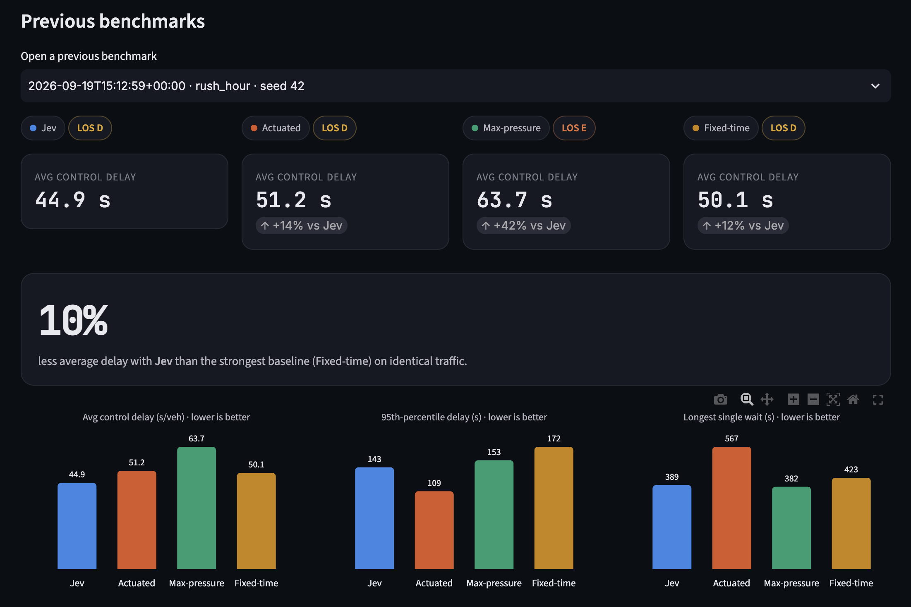
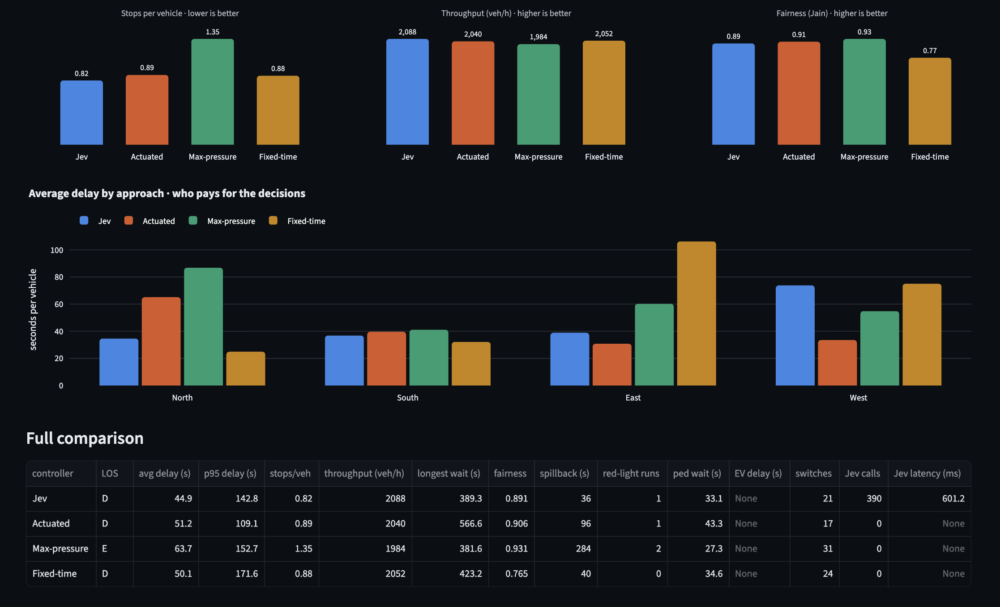

<div align="center">

# 🚦 JevFlow

**Real-time traffic-signal control with [TypeSafe Jev](https://docs.typesafe.ai/), on a simulation that refuses to cheat.**

The simulator knows where every car is. The controller doesn't: it only sees what its loop detectors report.


https://github.com/user-attachments/assets/d1984490-2cf3-4907-88bc-2a2271279d4a


</div>

---

## Why this is not a toy

Most "AI traffic light" demos hand the model the exact position of every vehicle. Real controllers never get that. JevFlow splits the world in two:

```
Simulation truth        → every vehicle, driver and pedestrian, exactly
      ↓
Virtual detectors       → inductive loops: presence at 10 Hz, misses, noise, faults
      ↓
Traffic-state aggregator→ queue, delay, speed, occupancy estimates + detector health
      ↓
Jev                     → chooses among *legal* actions, with probabilities + confidence
      ↓
Signal controller       → enforces min/max green, yellow, all-red, walk, preemption
```

Ground truth is used for one thing only: **grading** the controllers afterwards.

### Realism, layer by layer

| Layer             | What's modelled                                                                                                                                                                                                                                                                                                                                 |
| ----------------- | ----------------------------------------------------------------------------------------------------------------------------------------------------------------------------------------------------------------------------------------------------------------------------------------------------------------------------------------------- |
| **Vehicles**      | Vectorised [Intelligent Driver Model](https://en.wikipedia.org/wiki/Intelligent_driver_model), with individual desired speed, time gap, acceleration and braking per driver. Cars, vans, buses, trucks, ambulances.                                                                                                                             |
| **Drivers**       | Reaction delay when moving off, so start-up lost time and ~1,650 veh/h/lane saturation flow _emerge_ rather than being scripted. Stop/go choice at yellow onset (dilemma zone), including rare real red-light running. Gap acceptance for permissive left turns, with "sneakers" on the change interval. Turning vehicles yield to pedestrians. |
| **Demand**        | Cowan M3 bunched headways (Akçelik & Chung), time-varying profiles, platoons released by an upstream signal, and finite approaches with an off-map _vertical queue_ when traffic spills back.                                                                                                                                                   |
| **Signal timing** | Yellow and all-red intervals derived from the **ITE** kinematic formulas. MUTCD pedestrian walk and clearance. Max-out only when a conflicting call is waiting. Emergency preemption that never skips clearance intervals.                                                                                                                      |
| **Detectors**     | Per lane: a stop-line loop, an advance dual-loop speed trap and an upstream entry loop. Per-vehicle misses, false actuations, speed quantisation, and scheduled **stuck-on / dead / chattering** faults.                                                                                                                                        |
| **Estimation**    | Input–output queue counting with a discharge-wave model and drift re-anchoring. FIFO delay re-identification. Harmonic-mean speed. Plausibility checks that flag broken loops and fall back to historical-volume models.                                                                                                                        |
| **Evaluation**    | HCM control delay and level of service, 95th-percentile delay, stops, throughput, Jain fairness, spillback time, red-light violations, pedestrian and emergency-vehicle delay. Vehicles still waiting at the end are counted with their accrued delay, so starving an approach can't win.                                                       |

---

## How Jev is used

Jev is a _System One_ model: structured state in, typed decision out. JevFlow follows TypeSafe's guidance to the letter: **code calculates, Jev judges.**

- **Only legal actions are offered.** The safety guard derives them from the controller state (min green met? room to extend before max-out?), so the Choice's answer space itself makes an unsafe answer impossible.
- **Code does the arithmetic.** The state includes deterministic phase-level summaries (queue served vs waiting, longest red wait, green left before max-out, switching lost time) next to the raw per-approach detector data.
- **Criteria carry the domain knowledge.** Each option has `what` / `prefer_when` / `avoid_when`.
- **Always applied.** When Jev returns a usable legal choice, it is applied regardless of confidence. Only API errors and an open circuit breaker hand control to an actuated fallback, so the intersection never waits on the network.
- **Latency is real.** In live mode Jev runs concurrently with the simulation. An answer that arrives after the phase has changed is rejected as stale.
- **Fully auditable.** Every call's exact state, questions, probabilities, confidence, latency and tokens are stored and viewable in the UI.

```python
response = await client.system_one(
    state=build_state(context).model_dump(mode="json"),   # Pydantic-validated
    questions={
        "next_action": Choice(
            instructions="Which legal action should the signal take next ...?",
            criteria={
                "keep_current_phase":   {"what": ..., "prefer_when": ..., "avoid_when": ...},
                "extend_current_green": {...},
                "switch_to_east_west":  {...},
            },
        ),
        "congestion": Score(instructions="How congested is this intersection?", criteria=[...5 concrete levels]),
    },
)
answer = response.choices["next_action"]   # .choice, .probabilities, .confidence
```

<details>
<summary>Example state sent to Jev (abridged)</summary>

```json
{
  "intersection_id": "jevflow_main_and_1st",
  "signal": {
    "current_phase": "north_south_green",
    "phase_elapsed_seconds": 22.4,
    "minimum_green_seconds": 10.0,
    "maximum_green_seconds": 60.0,
    "green_remaining_before_max_out_seconds": 37.6,
    "switch_lost_time_seconds": 7.5,
    "time_since_east_last_received_green": 41.9
  },
  "approaches": {
    "north": {
      "currently_green": true,
      "volume_vehicles_30s": 9,
      "occupancy_percent": 61.3,
      "average_speed_kmh": 8.4,
      "estimated_queue_vehicles": 11.2,
      "average_delay_seconds": 29.8,
      "detector_health": "ok"
    }
  },
  "phase_summary": {
    "east_west": {
      "status": "waiting_on_red",
      "total_queue_vehicles": 6.0,
      "longest_wait_since_green_seconds": 41.9,
      "pedestrians_waiting": true
    }
  },
  "special_conditions": {
    "emergency_vehicle_present": false,
    "queue_spillback_detected": false,
    "detectors_degraded": []
  },
  "legal_actions": [
    "keep_current_phase",
    "extend_current_green",
    "switch_to_east_west"
  ]
}
```

</details>

---

## Quickstart

Requires Python 3.13+ and [uv](https://docs.astral.sh/uv/).

```bash
git clone https://github.com/<you>/jevflow && cd jevflow
uv sync
cp .env.example .env          # add TYPESAFE_API_KEY from https://console.typesafe.ai/
uv run jevflow up             # API on :8000 + dashboard on :8501
```

Without an API key everything still runs; only the Jev controller is disabled.

```bash
uv run jevflow benchmark --scenario stadium_surge     # compare controllers in the terminal
uv run jevflow scenarios                              # list scenarios
uv run jevflow api                                    # run the services separately…
uv run jevflow dashboard                              # …in two terminals
```

Interactive API docs: <http://127.0.0.1:8000/docs>

---

## Scenarios

| Key                  | Scenario           | What it tests                                                 |
| -------------------- | ------------------ | ------------------------------------------------------------- |
| `rush_hour`          | Morning Rush       | A platooned commuter wave on north–south vs a side street     |
| `balanced_midday`    | Balanced Midday    | Even demand, heavy pedestrian calls lengthening min greens    |
| `stadium_surge`      | Stadium Let-Out    | East–west demand past capacity; spillback on short approaches |
| `emergency_corridor` | Emergency Response | Three ambulances; preemption and queue recovery               |
| `sensor_faults`      | Failing Detectors  | Stuck-on, dead and chattering loops; graceful degradation     |
| `left_turn_crunch`   | Left-Turn Crunch   | Heavy permissive lefts against strong opposing flow           |
| `late_night`         | Late Night         | Sparse demand: rest in green, no pointless red                |

## Controllers

All controllers see **detector data only**. Benchmarks use common random numbers: identical vehicles, drivers and pedestrians for every controller.

| Key            | Controller           | Idea                                                                  |
| -------------- | -------------------- | --------------------------------------------------------------------- |
| `jev`          | Jev (TypeSafe)       | Typed choice among legal actions; actuated only if Jev is unavailable |
| `actuated`     | Actuated (gap-out)   | NEMA-style: extend green while detectors fire, gap out after 3 s      |
| `max_pressure` | Max-pressure         | Varaiya (2013), on _estimated_ queues, with a switching margin        |
| `fixed_time`   | Fixed-time (Webster) | Pre-timed plan from design-hour volumes                               |




---

## Architecture

```
src/jevflow/
├── domain/          # enums, geometry (Bézier turn paths), ITE timing, observation models
├── simulation/      # ground truth: IDM fleet (NumPy SoA), engine, signal controller, pedestrians, demand, scenarios
├── sensing/         # virtual loop detectors + traffic-state aggregator (the only view controllers get)
├── control/         # Strategy interface, safety guard, baselines, factory
│   └── jev/         # state builder, questions, SDK adapter (port/adapter), always-apply strategy
├── runtime/         # sessions (live + headless), manager, benchmark runner, ground-truth evaluation
├── persistence/     # SQLite repository (WAL): runs, 1 Hz metrics, decisions, benchmarks
├── api/             # FastAPI app factory, DI, REST + WebSocket stream
└── dashboard/       # Streamlit + Plotly; a 60 fps canvas component fed directly by the WebSocket
```

**Patterns:** Strategy (controllers), Ports & Adapters (Jev client), Factory/Registry (controllers, scenarios), Circuit Breaker (Jev calls), Repository (SQLite), and an app factory with dependency injection (FastAPI).

**Performance:** the engine updates every vehicle with a few vectorised NumPy operations per 100 ms tick (leader search is one `lexsort`). A 15-minute scenario with the full detector and estimation pipeline runs headless in about 2–3 s.

---

## Development

```bash
uv run pytest           # 30 tests: signal safety, IDM, engine realism, sensing, Jev (incl. real SDK over a mock transport), API
uv run ruff check src tests && uv run ruff format --check src tests
uv run mypy src tests   # strict
```

Configuration lives in environment variables (`JEVFLOW_*`, see [`.env.example`](.env.example) and [`config.py`](src/jevflow/config.py)).

## Scope and limitations

- A single four-leg intersection with two-phase operation and permissive lefts. There are no protected-left phases or coordination with neighbouring signals yet.
- Vehicles don't interact inside the junction box beyond gap acceptance and following on the exit lane.
- Detector noise parameters are plausible field values, not calibrated to a specific site.

## References

Treiber, Hennecke & Helbing (2000) · Highway Capacity Manual · ITE (2020) change & clearance intervals · MUTCD 4E · Varaiya (2013) · Akçelik & Chung (1994) · Liu et al. (2009) · [TypeSafe docs](https://docs.typesafe.ai/)

## License

MIT
